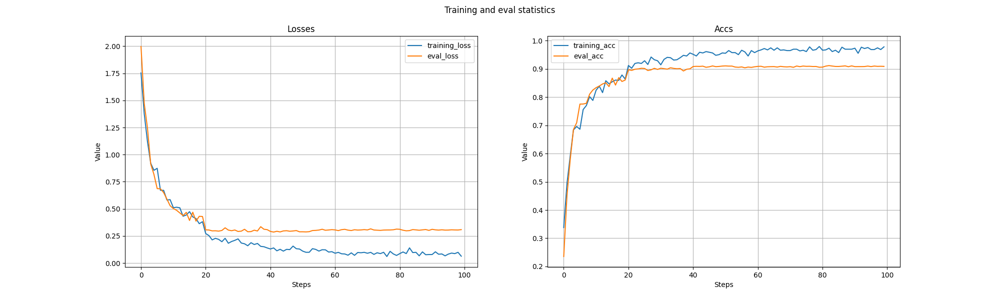
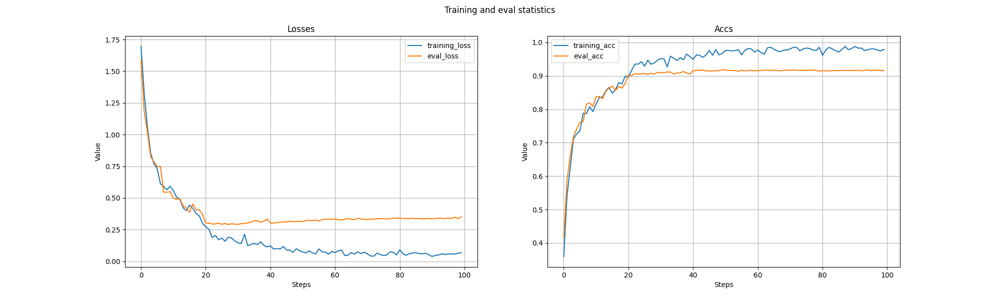

# Reproducing ***FocusedDropout for Convolutional Neural Network***

First of all, thank the authors very much for sharing this excellent paper ***<FocusedDropout for Convolutional Neural Network>*** with us. This repository contains FoucusedDropout and simple verification for modified VGG16
with CIFAR10. If there are some bug problems in the 
implementation, please send me an email at yuranusduke@163.com or simply add issue.

## Backgrounds
In this paper, authors propose a novel dropout technique -- FocusedDropout, which does not drop neurons randomly, but 
focuses more on elements related with classification information.


And whole algorithm goes,


One can read paper carefully to understand how and why they design algorithm like this.

## Requirements

```Python
pip install -r requirements.txt 
```

## Implementation

We simply run CIFAR10 with modified VGG16(with BatchNorm and less parameters in fc layer).

### Hyper-parameters and defaults
```bash
--device='cuda' # 'cuda' for gpu, 'cpu' otherwise
--dropout=0.5 # dropout rate
--use_dropout=True # True to enable simple dropout
--use_focused_dropout=False # True to enable FocusedDropout. Note that use_dropout and use_focused_dropout should not be activated at the same time, they are used to do comparison experiments
--par_rate: participation rate, we use 0.01 in one batch UNLIKE in original paper
--epochs=80 # training epochs
--batch_size=64 # batch size
--init_lr=0.1 # initial learning rate
--gamma=0.2 # learning rate decay
--milestones=[40,60,80] # learning rate decay milestones
--weight_decay=9e-6 # weight decay
```

### Train & Test

```python

    python example.py main \
     --device='cuda' \
     --dropout=0.5 \
     --use_dropout=True \
     --use_focused_dropout=False \
     --epochs=100 \
     --batch_size=20 \
     --init_lr=0.1 \
     --par_rate=0.1 \
     --gamma=0.2 \
     --milestones=[20,40,60,80] \
     --weight_decay=1e-5 

```

## Results

### Dropout & FocusedDropout
| Model             | Acc.        |
| ----------------- | ----------- |
| baseline       	| 90.85%      |
| Dropout           | 90.90%      |
| FocusedDropout    | **91.66%**  |


## Training statistics

### Dropout


### FocusedDropout


## Paper References
- FocusedDropout for Convolutional Neural Network [[arXiv]](https://arxiv.org/abs/2103.15425)

***<center>Veni，vidi，vici --Caesar</center>***
